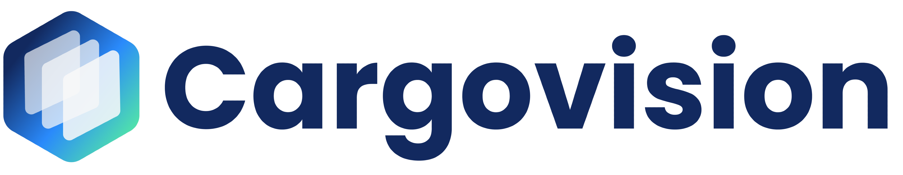

  
  <h1 align="center">CargoVision</h1>

**Smarter, Faster, Safer Container Inspections with AI**

CargoVision is an AI-powered mobile and web platform designed to analyze X-ray images of shipping containers, enabling real-time detection of structural damage and illegal items. It automates the entire inspection workflow — from image analysis to report generation — enhancing efficiency, accuracy, and security in cargo logistics.

---

## 🚀 Features

- **AI-Based Image Analysis**: Automatically detects structural anomalies and contraband in container X-ray scans using YOLOv8.
- **Real-Time Detection**: Instant insights from uploaded images without opening containers.
- **Auto Report Generation**: NLP-powered inspection summaries in text, visual, and PDF formats.
- **Mobile & Web Platform**: Accessible for both field officers and central teams.
- **Visual Dashboard**: Intuitive interface with object highlights, risk indicators, and inspection history.

---

## 🧠 How It Works

1. **Upload X-Ray Image**  
   Field officer or operator uploads container X-ray through the mobile/web interface.

2. **AI-Powered Detection (YOLOv8)**  
   A custom-trained YOLOv8 model running on a Python FastAPI server inside a Docker container performs real-time object detection.

3. **NLP-Based Summary**  
   The system generates an automated inspection summary and recommendation using transformer-based NLP models.

4. **Instant Report**  
   Output is delivered as a downloadable report (PDF), including annotated images and decision support insights.

---

## 🐳 AI Microservice Architecture

- **Object Detection Service**:
  - Model: `YOLOv8`
  - Server: `FastAPI`
  - Packaged as: `Docker container`
  - Input: Container X-ray image
  - Output: JSON with bounding boxes, labels, confidence, and annotated image

- **NLP Summary Service**:
  - Summarizes inspection findings
  - Generates human-readable text report

---

## 🎯 Target Users

- Port Authorities & Customs
- Logistics & Shipping Companies
- Government Regulatory Agencies
- Security & Inspection Teams

---

## 📦 Tech Stack

- **Frontend**: React (Web), React Native (Mobile)
- **Backend**: Node.js, Express
- **AI/ML**:
  - YOLOv8 (Ultralytics) for object detection
  - FastAPI for serving detection API
  - Transformer-based NLP for report generation
- **Containerization**: Docker
- **Cloud**: Linux Ubuntu 22.04 Server for inference, storage, and deployment

---

## 💡 Vision

CargoVision aims to revolutionize cargo inspection by providing an intelligent, automated solution that eliminates the need for physical container checks, reduces human error, and ensures faster, more secure logistics operations worldwide.

---

## 📈 Business Model

- **SaaS Subscription**: Pay-per-container or monthly usage
- **Enterprise License**: Annual licensing for institutions
- **Add-ons**: ERP integration, advanced analytics, custom AI training

---

## 📬 Contact

For demo, pilot projects, or partnership inquiries:  
📧 contact@cargovision.app
🌐 [https://cargovision.app](https://cargovision.app)

---

> © 2025 CargoVision. All rights reserved.